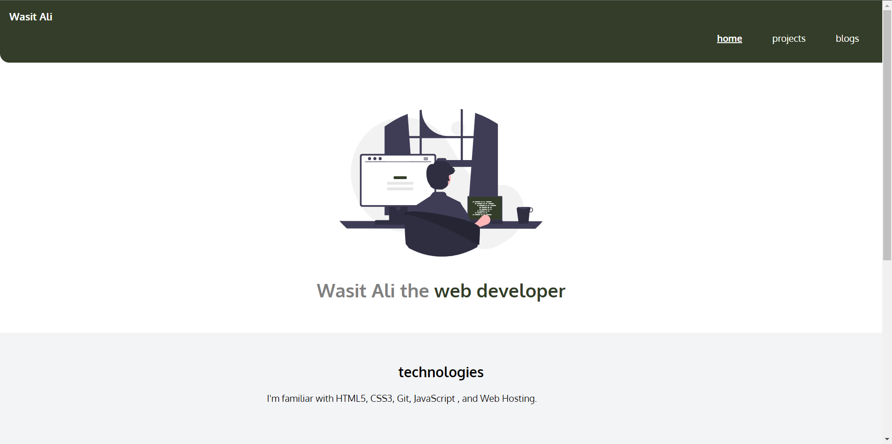

# | Porfolio Web Page
Hi there,
I'm Wasit Ali and this is my portfolio web page purely made with HTML and CSS. You can find my projects as well as blogs here.

## ⚒️ Technologies Used
 - HTML
 - CSS

## 🖥 Preview

`note:` please make sure the preview screen is `1920 x 1080` and the site is fully **responsive** by design. 

[Live Preview](https://qwerty-fi.netlify.app)

## 👀 What I have learned in this project?
- Clear understanding of flexbox and its use in reponsive web design.
- CSS positioning property.
- More about linking web-pages and different other resources to the project.

## ⏲ Time to finish the project
It took me around 20hrs in order to complete this project.